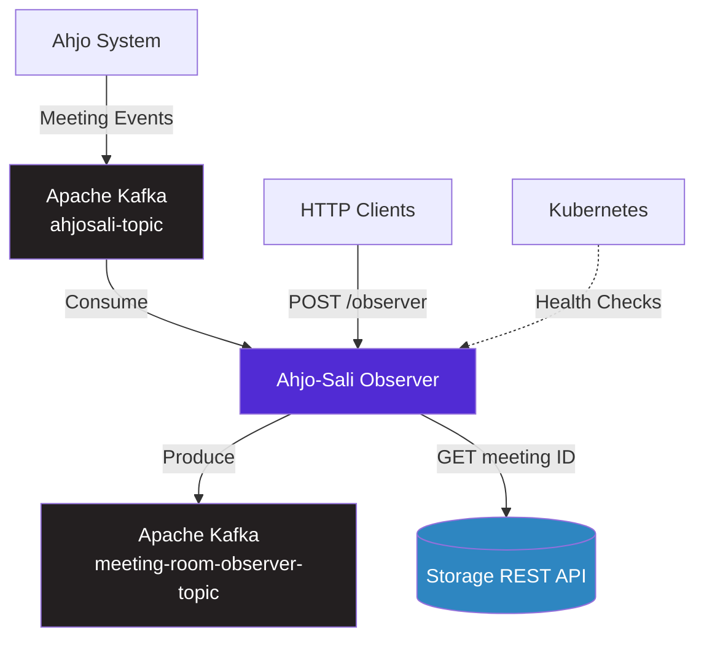
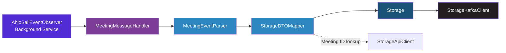
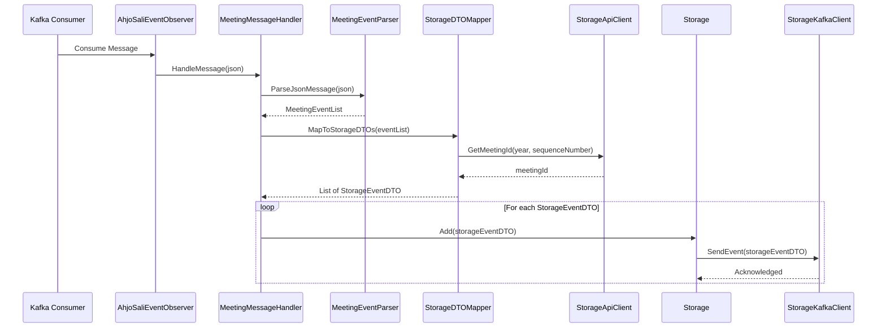

# Datapumppu Ahjo-Sali Observer


An ASP.NET Core 10 microservice that consumes meeting room events from the Ahjo municipal decision-making system via Apache Kafka, transforms them into a normalized storage format, and forwards them for persistence in the Datapumppu ecosystem.

## Table of Contents

- [Datapumppu Ahjo-Sali Observer](#datapumppu-ahjo-sali-observer)
  - [Table of Contents](#table-of-contents)
  - [About](#about)
  - [Key Features](#key-features)
  - [Architecture](#architecture)
    - [System Context](#system-context)
    - [Internal Architecture](#internal-architecture)
    - [Event-Driven Architecture](#event-driven-architecture)
  - [Built With](#built-with)
  - [Prerequisites](#prerequisites)
  - [Getting Started](#getting-started)
    - [Installation](#installation)
    - [Configuration](#configuration)
    - [Running Locally](#running-locally)
    - [Docker Setup](#docker-setup)
  - [API Documentation](#api-documentation)
    - [API Overview](#api-overview)
    - [Key Endpoints](#key-endpoints)
    - [Event Types](#event-types)
  - [Deployment](#deployment)
    - [Dev/test environment](#devtest-environment)
    - [Staging/Production environment](#stagingproduction-environment)
    - [CI/CD Pipeline](#cicd-pipeline)
    - [Health Monitoring](#health-monitoring)
  - [Development](#development)
    - [Project Structure](#project-structure)
    - [Code Documentation](#code-documentation)
    - [Testing](#testing)

## About

The **Datapumppu Ahjo-Sali Observer** is an ASP.NET Core 6 microservice that monitors and processes real-time meeting room events from the City of Helsinki's Ahjo decision-making system. It consumes raw event data from a Kafka topic, parses and maps the events into a normalized storage format, and publishes the transformed events to an outbound Kafka topic for downstream persistence services.

This service handles:
- **Event Consumption**: Listens to the `ahjosali-topic` Kafka topic for raw meeting room events from the Ahjo system
- **Event Parsing**: Deserializes JSON event payloads into strongly-typed DTOs covering 22 distinct event types
- **Event Mapping**: Transforms Ahjo-specific DTOs into normalized storage DTOs using AutoMapper, including meeting ID resolution via a REST API
- **Event Forwarding**: Publishes mapped storage events to the `meeting-room-observer-topic` Kafka topic for downstream consumers

## Key Features

- **22 Meeting Event Types** -- Processes the full range of municipal meeting events including voting, speeches, roll calls, pauses, and participant tracking
- **Kafka Consumer/Producer Pipeline** -- Background service continuously consumes and produces Kafka messages with configurable topics
- **Meeting ID Resolution** -- Resolves internal meeting identifiers by querying an external storage REST API by year and sequence number
- **SASL/SSL Production Authentication** -- Supports SASL-SCRAM-SHA-512 authentication with PEM certificates for secured Kafka clusters
- **Health Check Endpoints** -- Exposes `/healthz` and `/readiness` endpoints for Kubernetes liveness and readiness probes
- **HTTP Event Ingestion** -- Provides a `POST /observer` endpoint for direct event submission outside the Kafka pipeline

## Architecture

### System Context

The Ahjo-Sali Observer is one microservice within the larger **Datapumppu ecosystem**. It integrates with external systems as shown below:



### Internal Architecture

The Ahjo-Sali Observer follows a **pipeline** pattern:



**Layer Responsibilities:**

- **Events** (`Events/`) -- Kafka consumer background service and client factory
- **Handler** (`Handler/`) -- JSON event parsing and input DTO definitions
- **Mapper** (`Mapper/`) -- Event type, vote type, speech type, and full DTO mapping
- **StorageClient** (`StorageClient/`) -- Kafka producer, REST API client, and output DTO definitions

### Event-Driven Architecture

Events flow through the system as follows:



**Supported Event Types** (22 total):
- **Meeting Lifecycle**: Meeting Starts, Meeting Ends, Meeting Continues, Pause, Pause Info
- **Voting**: Voting Starts, Voting Ends
- **Speech/Statements**: Speech Starts, Speech Ends, Speech Timer, Statements List, Floor Reservation, Floor Reservations Cleared, Reply Reservation, Reply Reservations Cleared, Discussion Starts, Propositions
- **Participants**: Roll Call Starts, Roll Call Ends, Person Arrived, Person Left, Attendees (Case)

## Built With

| Technology | Version | Purpose |
|------------|---------|---------|
| [.NET](https://dotnet.microsoft.com/) | 10.0 | Application framework |
| [Confluent.Kafka](https://github.com/confluentinc/confluent-kafka-dotnet) | 2.14.2 | Kafka producer and consumer client |
| [AutoMapper](https://automapper.org/) | 14.0.0 | Object-to-object mapping |
| [Newtonsoft.Json](https://www.newtonsoft.com/json) | 13.0.1 | JSON serialization and deserialization |
| [Azure.Messaging.ServiceBus](https://github.com/Azure/azure-sdk-for-net) | 7.20.1 | Azure Service Bus client (referenced, not actively used) |
| [xUnit](https://xunit.net/) | 2.4.2 | Unit testing framework |
| [Moq](https://github.com/moq/moq4) | 4.18.2 | Mocking framework for tests |

## Getting Started

The Observer is fully containerized and designed to run out-of-the-box using Docker Compose. It integrates seamlessly with the **`datapumppu-storage`** environment, communicating over the shared external Docker network `datapumppu-network` to resolve the Kafka broker (`shared-kafka`) and the Storage Service (`storage-service`).

### Prerequisites
- **[Docker](https://www.docker.com/)** and **Docker Compose** installed.
- Ensure the `datapumppu-storage` services are already running (which sets up `datapumppu-network`, the shared Kafka broker, and the pre-configured Kafka topics).

### Running with Docker Compose
To build and start the Observer, navigate to the repository root and run:
```bash
docker-compose up --build -d
```

The service will start automatically, map its port to `http://localhost:8082`, and connect to `shared-kafka:9092` and `http://storage-service` out-of-the-box.

### Configuration
Environment variables are pre-configured in `docker-compose.yml` to work out-of-the-box. If custom settings are needed, they can be configured via environment variables:

| Variable | Description | Pre-configured Value / Default |
|----------|-------------|--------------------------------|
| `KAFKA_BOOTSTRAP_SERVER` | Kafka broker address inside the Docker network | `shared-kafka:9092` |
| `KAFKA_CONSUMER_TOPIC` | Kafka topic to consume raw events from | `ahjosali-topic` |
| `KAFKA_PRODUCER_TOPIC` | Kafka topic to produce normalized events to | `meeting-room-observer-topic` |
| `KAFKA_GROUP_ID` | Kafka consumer group identifier | `ahjosali-consumer` |
| `STORAGE_URL` | Base URL of the Storage API | `http://storage-service` |
| `KAFKA_USER_USERNAME` | SASL username (production only) | *(secret / required in prod)* |
| `KAFKA_USER_PASSWORD` | SASL password (production only) | *(secret / required in prod)* |
| `SSL_CERT_PEM` | PEM-encoded SSL certificate (production only) | *(secret / required in prod)* |
| `OBSERVER_API_KEY` | Optional API Key for `/observer` POST endpoint protection | *(optional / empty by default)* |

## API Documentation

### API Overview

The Ahjo-Sali Observer provides a minimal HTTP API alongside its primary Kafka-based event pipeline:

| Controller | Purpose | Example Endpoints |
|------------|---------|-------------------|
| **Observer** | Direct event ingestion | `POST /observer` |
| **Health** | Kubernetes probes | `GET /healthz`, `GET /readiness` |

### Key Endpoints

| Method | Endpoint | Description |
|--------|----------|-------------|
| POST | `/observer` | Accepts a raw Ahjo JSON event payload for processing |
| GET | `/healthz` | Liveness probe for Kubernetes |
| GET | `/readiness` | Readiness probe for Kubernetes |

**Example Request:**
```bash
# Submit an event directly via HTTP
curl -X POST http://localhost:8080/observer \
  -H "Content-Type: application/json" \
  -d '{"tapahtumalista": { ... }}'
```

### Event Types

The system processes **22 different event types**:

| Event Type (Finnish) | Storage Event Type | Category |
|----------------------|-------------------|----------|
| `kokous alkaa` | MeetingStarted | Meeting Lifecycle |
| `kokous paattynyt` | MeetingEnded | Meeting Lifecycle |
| `kokous jatkuu` | MeetingContinues | Meeting Lifecycle |
| `tauko` | Pause | Meeting Lifecycle |
| `taukotiedote` | PauseInfo | Meeting Lifecycle |
| `aanestys alkaa` | VotingStarted | Voting |
| `aanestys paattynyt` | VotingEnded | Voting |
| `nimenhuuto alkaa` | RollCallStarted | Participants |
| `nimenhuuto paattynyt` | RollCallEnded | Participants |
| `henkilo saapunut` | PersonArrived | Participants |
| `henkilo poistunut` | PersonLeft | Participants |
| `asia/kohta` | Case / Attendees | Participants |
| `keskustelu alkaa` | DiscussionStarts | Speech/Statements |
| `puheenvuorovaraus` | StatementReservation | Speech/Statements |
| `puheenvuorovaraukset tyhjatty` | StatementReservationsCleared | Speech/Statements |
| `puheenvuoro alkaa` | StatementStarted | Speech/Statements |
| `puheenvuoro paattynyt` | StatementEnded | Speech/Statements |
| `pidetyt puheenvuorot` | Statements | Speech/Statements |
| `repliikkivaraus` | ReplyReservation | Speech/Statements |
| `repliikkivaraukset tyhjatty` | ReplyReservationsCleared | Speech/Statements |
| `puheaikakello` | SpeechTimer | Speech/Statements |
| `ehdotukset` | Propositions | Speech/Statements |

See [StorageEventType.cs](MeetingRoomObserver/StorageClient/StorageEventType.cs) for the complete enumeration.

## Deployment

### Dev/test environment

Open a PR and target the **develop** branch. Once the branch gets merged, Azure pipelines will take care of deployment.

### Staging/Production environment

Open a PR from **develop** and target the **master** branch. Once the branch gets merged, Azure pipelines will take care of deployment.

### CI/CD Pipeline

The project uses **Azure Pipelines** for continuous integration and deployment:

- **Development Branch:** [azure-pipelines-build-develop.yml](azure-pipelines-build-develop.yml) -- Triggers on pushes to `develop`, runs on the `Default` agent pool
- **Production Branch:** [azure-pipelines-build-master.yml](azure-pipelines-build-master.yml) -- Triggers on pushes to `master`, runs on the `Production` agent pool

### Health Monitoring

The application exposes health check endpoints for Kubernetes probes:

| Endpoint | Type | Use Case |
|----------|------|----------|
| `/healthz` | Liveness | Restarts unhealthy pods |
| `/readiness` | Readiness | Routes traffic only when ready |

**Kubernetes Health Check Configuration:**
```yaml
livenessProbe:
  httpGet:
    path: /healthz
    port: 8080
  initialDelaySeconds: 10
  periodSeconds: 10

readinessProbe:
  httpGet:
    path: /readiness
    port: 8080
  initialDelaySeconds: 5
  periodSeconds: 5
```

## Development

### Project Structure

```
datapumppu-ahjosali-observer/
├── MeetingRoomObserver/
│   ├── Events/                 # Kafka consumer and client factory
│   │   └── Providers/          # Kafka client creation with SSL/SASL
│   ├── Handler/                # JSON event parsing
│   │   └── DTOs/               # Input DTOs (Ahjo event format)
│   ├── Mapper/                 # Event type and DTO mapping
│   ├── Models/                 # Domain models
│   ├── StorageClient/          # Kafka producer and REST API client
│   │   └── DTOs/               # Output DTOs (storage format)
│   ├── Properties/             # Launch settings
│   ├── Program.cs              # Application entry point and DI registration
│   └── MeetingRoomObserver.csproj
├── UnitTests/                  # Unit tests (xUnit + Moq)
├── kafka/                      # Kafka resource definitions
├── Dockerfile                  # Container build specification
├── azure-pipelines-build-develop.yml
├── azure-pipelines-build-master.yml
└── MeetingRoomObserver.sln     # Solution file
```

### Code Documentation

All public types and methods include **XML documentation comments** following C# standards:

```csharp
/// <summary>
/// Parses a raw JSON message from the Ahjo system into a structured event list.
/// </summary>
/// <param name="jsonMessage">The raw JSON string from the Kafka message.</param>
/// <returns>A <see cref="MeetingEventList"/> containing the parsed events.</returns>
public MeetingEventList ParseJsonMessage(string jsonMessage)
```

Documentation is automatically generated when building with `<GenerateDocumentationFile>true</GenerateDocumentationFile>`.

### Testing

**Unit Tests:** Located in [UnitTests/](UnitTests/)

**Run Tests:**
```bash
# Run all tests
dotnet test

# Run tests with coverage
dotnet test /p:CollectCoverage=true

# Run a specific test class
dotnet test --filter "FullyQualifiedName~MeetingEventParserTests"
```

**Test Coverage:**

| Test Class | Covers |
|-----------|--------|
| MeetingEventParserTests | Event parsing for voting, speech, and statement events |
| MeetingEventTypeMapperTests | Event type string-to-enum mapping |
| SpeechTypeMapperTests | Speech type mapping (reply vs. statement) |
| VoteTypeMapperTests | Vote type mapping (aye, nay, empty, absent) |
| VotingTypeMapperTests | Voting type mapping (normal, procedural types) |
| StorageDTOMapperTests | Full DTO transformation pipeline |
| StorageTests | Storage routing and validation |
| StorageKafkaClientTests | Kafka producer lifecycle and message delivery |

---

**Last Updated:** 20.03.2026